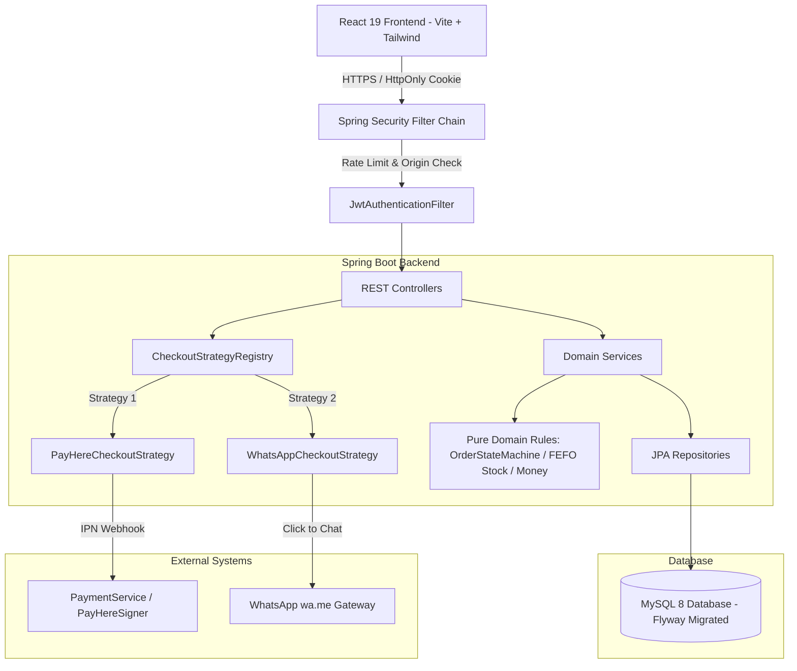

# GlowVera — Premium Cosmetics & Beauty E-Commerce Platform

[](https://www.oracle.com/java/)
[](https://spring.io/projects/spring-boot)
[](https://react.dev/)
[](https://vitejs.dev/)
[](https://tailwindcss.com/)
[](LICENSE)

**GlowVera** is a full-stack, enterprise-grade E-Commerce platform tailored for cosmetics and beauty products. Designed with **Domain-Driven Design (DDD)**, **SOLID principles**, and **Defense-in-Depth security**, it features FEFO (First-Expired, First-Out) inventory management, dual checkout options (PayHere Sandbox online payments & WhatsApp order dispatch), and a responsive Admin Panel.

---

## 🌟 Key Architecture & Technical Highlights

### 1. SOLID Principles & OOP Design
* **Open/Closed Principle (Strategy Pattern)**: The checkout engine uses a pluggable `CheckoutStrategy` interface (`PayHereCheckoutStrategy`, `WhatsAppCheckoutStrategy`). Adding new payment mechanisms (e.g., Stripe, Cash on Delivery) requires **zero modifications** to `OrderService`.
* **Single Responsibility Principle (SRP)**: Services are strictly decoupled into focused domain components:
  * `OrderPlacementService`: Handles transactional order creation & stock reservations.
  * `OrderTransitionService`: Manages state machine transitions (`PENDING` → `PAID` → `DISPATCHED` → `DELIVERED`).
  * `OrderExpiryService`: Scheduled background cleaner releasing abandoned cart reservations.
  * `PaymentService`: Verifies PayHere signatures and handles webhook idempotency.
  * `WhatsAppService`: Formats structured click-to-chat order payloads.
  * `InventoryService`: Manages batch-level FEFO stock allocations.
* **Domain-Driven Design (DDD)**: Core domain logic resides in `com.glowvera.domain` (e.g., `CartRules`, `CouponMath`, `Money`, `OrderStateMachine`, `StockMath`) as pure Java without Spring dependencies, making 100% of domain rules unit-testable.

### 2. Cosmetics-Specific FEFO Inventory Engine
* **Batch & Expiry Management**: Cosmetics have finite shelf lives. Inventory is tracked per batch (`batch_number`, `expiry_date`).
* **First-Expired, First-Out (FEFO)**: When orders are reserved or fulfilled, stock is automatically drawn from batches expiring earliest.
* **Reservation Lifecycle**: Stock is reserved upon order placement. If an order remains unpaid, a background scheduler automatically releases reserved stock back to the original batch after a configurable expiration window.

### 3. Dual Checkout Methods
* **PayHere Sandbox Payment**:
  * Secure MD5 hash generator complying with PayHere gateway requirements.
  * **Constant-Time Signature Verification** (`MessageDigest.isEqual`) to prevent timing side-channel attacks.
  * Webhook idempotency tracking to prevent double fulfillment from retried gateway callbacks.
* **WhatsApp Direct Order Dispatch**:
  * `WhatsAppMessageBuilder` formats cart items into clean, human-readable strings (`• Product — Variant × Qty`).
  * Automatically handles URL encoding for instant web/mobile WhatsApp launch (`wa.me`).

### 4. Enterprise Security Architecture
* **HttpOnly JWT Auth**: Authentication tokens are stored in `HttpOnly` cookies, mitigating XSS token theft risks.
* **CSRF & Origin Protections**: Secured via `OriginCheckFilter` requiring matching origins on state-changing requests, along with strict CORS rules.
* **Rate Limiting**: `RateLimitFilter` prevents brute-force attacks on sensitive endpoints (`/api/auth/*`).
* **Password Security**: Passwords hashed using BCrypt.
* **Role-Based Access Control (RBAC)**: Admin endpoints (`/api/admin/**`) are restricted exclusively to `ROLE_ADMIN`.

---

## 📐 System Architecture Diagram



---

## 🗄️ Database Design & Concurrency Control

* **Migration Engine**: Database schemas are managed using Flyway versioned migrations (`V1__init_schema.sql`, `V2__reference_data.sql`, `V3__coupons_and_discounts.sql`).
* **Concurrency & Locking**: 
  * High-concurrency checkout requests lock product variant rows with `SELECT ... FOR UPDATE` in ascending primary key order to prevent deadlocks.
  * DB-level check constraints (`CHECK (reserved_qty <= stock_qty)`) act as a final guard against stock overselling.
* **Money Representation**: All monetary values are calculated and stored in integer cents (`long`) to eliminate floating-point precision issues.

---

## 🛠️ Technology Stack

### Backend
* **Language & Framework**: Java 21, Spring Boot 3.5
* **Security**: Spring Security, JJWT, BCrypt
* **Persistence**: Spring Data JPA, Hibernate, MySQL 8, Flyway Migrations
* **Documentation**: SpringDoc OpenAPI / Swagger UI (`/swagger-ui.html`)
* **Testing**: JUnit 5, Mockito (59 passing automated unit & domain tests)

### Frontend
* **Core**: React 19, Vite 8, JavaScript (ESNext)
* **Styling**: Tailwind CSS v4, Custom GlowVera Design System
* **Routing & HTTP**: React Router v7, Axios

---

## 🚀 Quick Start & Installation

### Prerequisites
* **Java**: JDK 21+
* **Node.js**: v18+ & `npm`
* **MySQL**: 8.0+

### 1. Database Setup
Create a MySQL database:
```sql
CREATE DATABASE glowvera;
```

### 2. Backend Configuration (`server/.env`)
Copy `.env.example` to `.env` in the `server` directory and update your DB credentials:
```env
SPRING_DATASOURCE_URL=jdbc:mysql://localhost:3306/glowvera?useSSL=false&allowPublicKeyRetrieval=true&serverTimezone=UTC
SPRING_DATASOURCE_USERNAME=root
SPRING_DATASOURCE_PASSWORD=your_password

JWT_SECRET=your_super_secret_jwt_key_at_least_256_bits_long
PAYHERE_MERCHANT_ID=123456
PAYHERE_MERCHANT_SECRET=your_payhere_sandbox_secret
WHATSAPP_NUMBER=94771234567
```

### 3. Run Backend
```bash
cd server
mvn spring-boot:run
```
* API Base URL: `http://localhost:8080/api`
* Swagger UI Docs: `http://localhost:8080/swagger-ui.html`

### 4. Run Frontend
```bash
cd client
npm install
npm run dev
```
* App URL: `http://localhost:5173`

---

## 🧪 Running Automated Tests

Run backend unit and domain test suite:
```bash
cd server
mvn test
```
> **Test Status**: 59 / 59 tests passing (0 failures, 0 errors).

Build production bundle for frontend:
```bash
cd client
npm run build
```

---

## 📋 Interview Discussion Points

* **Why Layered & DDD Architecture?**: Keeping domain rules in `com.glowvera.domain` ensures critical business logic (stock math, state machine transitions, coupon math) is completely independent of frameworks, easily testable, and maintainable.
* **How are stock deadlocks prevented?**: `SELECT ... FOR UPDATE` locks variant rows in strict ascending ID order during checkout transactions.
* **Why FEFO for Cosmetics?**: Cosmetics expire. Selling First-Expired, First-Out reduces inventory waste and provides complete traceability if a batch recall is required.
* **Why HttpOnly Cookies for JWT?**: Storing tokens in HttpOnly cookies protects against token theft via XSS, while CSRF is mitigated using SameSite headers, strict Origin checking, and JSON-only POST APIs.

---

## 💡 Assumptions & Limitations

### Assumptions
* **Currency**: Transactions are calculated in Sri Lankan Rupees (LKR / Rs.) using integer cents (`long`) to eliminate floating-point drift.
* **Shipping Logistics**: Shipping fees are dynamically calculated based on Sri Lankan districts.
* **WhatsApp Order Flow**: Direct WhatsApp checkout sends formatted order payloads to a central business WhatsApp number for manual/automated confirmation.
* **PayHere Sandbox**: Payments are processed through the official PayHere Sandbox gateway environment.

### Limitations & Future Scope
* **Rate Limiting Scope**: The current `RateLimitFilter` uses an in-memory token bucket suitable for single-instance deployments; a distributed multi-node deployment would back rate limits with Redis.
* **Email Notifications**: Order confirmation emails are logged internally rather than dispatched via external SMTP services (e.g., AWS SES or SendGrid).
* **Refund Automation**: Payment cancellations and refunds are triggered via Admin Panel state transitions (`PENDING` / `PAID` → `CANCELLED`), which release reserved stock automatically, but automated PayHere Refund API triggers are handled manually via the PayHere merchant portal.

---

## 📄 License
This project is submitted as part of the Software Engineer Internship Technical Assessment.

